# Interesting Assets

这个仓库存储了各个项目中使用的图片、视频和模型等资源文件。

## 相关项目

以下是使用这些资源的项目：

### Eye Laser Game
[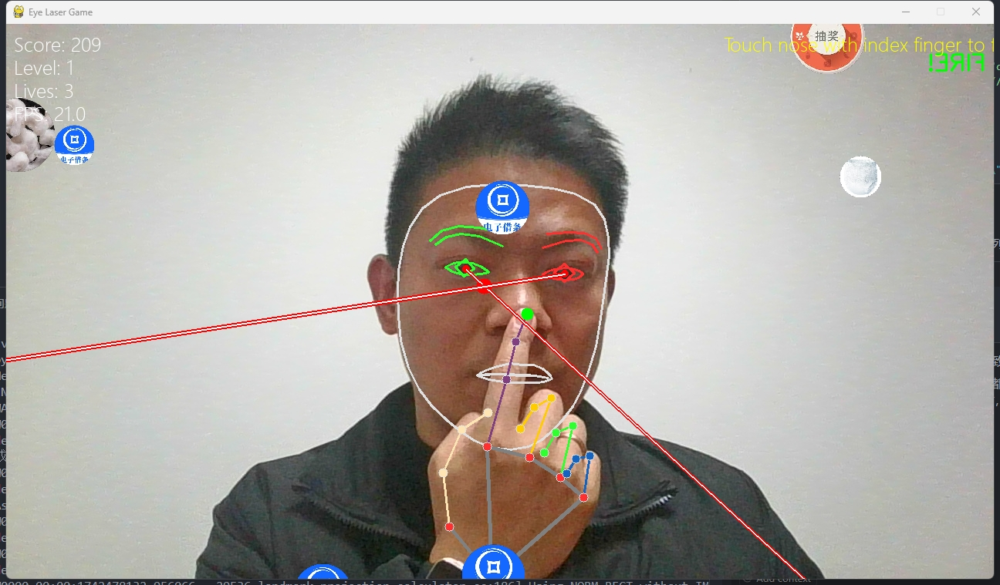](https://github.com/wangqiqi/gaze_laser_game)
- [项目地址](https://github.com/wangqiqi/gaze_laser_game) - 基于眼睛追踪的激光射击游戏

### Gesture Snake Game
[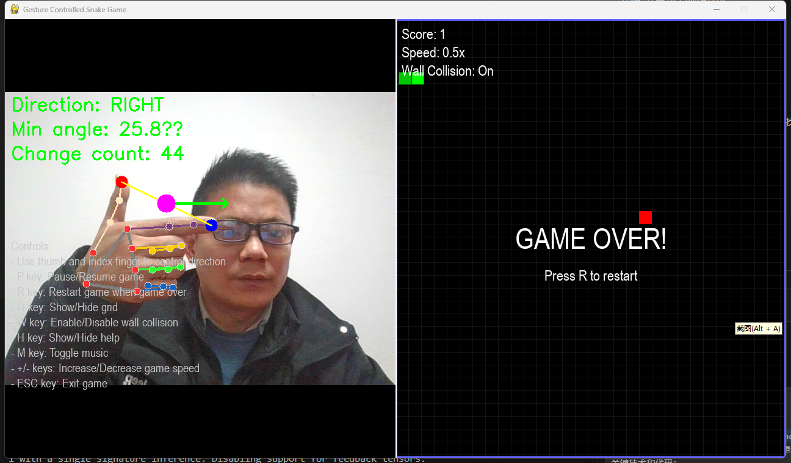](https://github.com/wangqiqi/gesture-snake)
- [项目地址](https://github.com/wangqiqi/gesture-snake) - 手势控制贪吃蛇游戏

### AR Pi Tattoo
[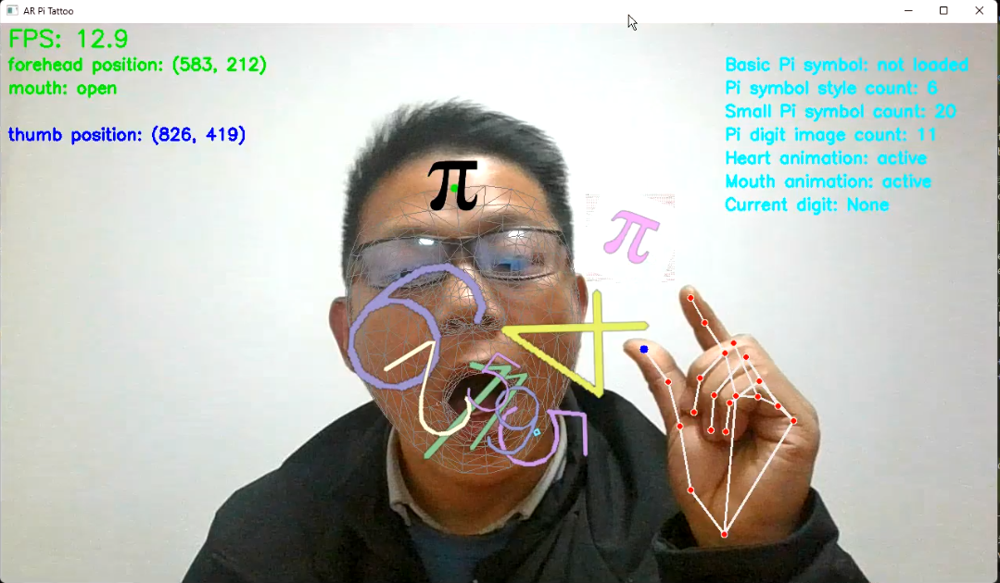](https://github.com/wangqiqi/ar_pi_tattoo)
- [项目地址](https://github.com/wangqiqi/ar_pi_tattoo) - 基于AR的圆周率纹身互动应用

### Head Racing Game
[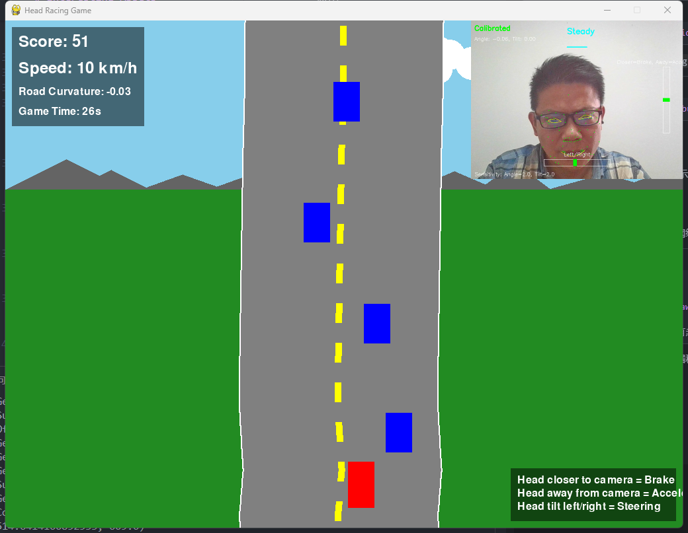](https://github.com/wangqiqi/head-racing-game)
- [项目地址](https://github.com/wangqiqi/head-racing-game) - 头部运动控制的赛车游戏

### Face Mask Application
[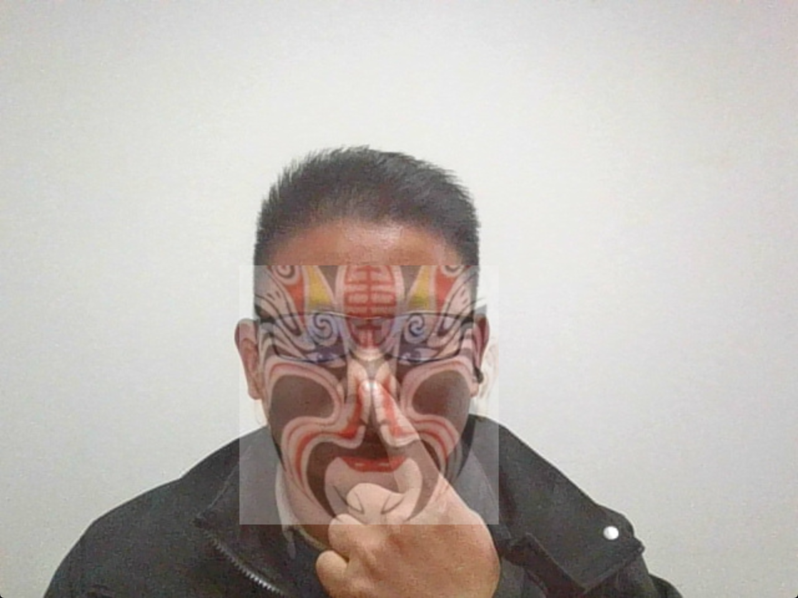](https://github.com/wangqiqi/face_mask)
- [项目地址](https://github.com/wangqiqi/face_mask) - 实时人脸面具应用

### Hand Gesture Volume Control
[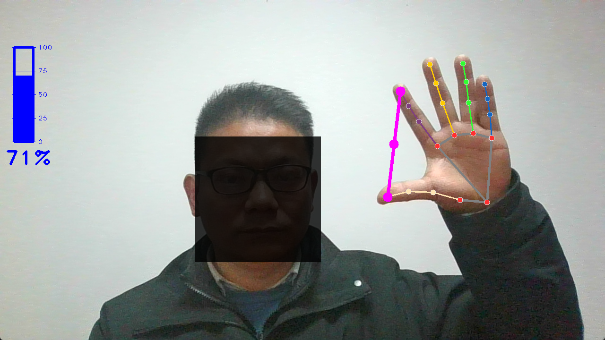](https://github.com/wangqiqi/hand_control_vol)
- [项目地址](https://github.com/wangqiqi/hand_control_vol) - 手势音量控制系统

### Scan Effect Generator
[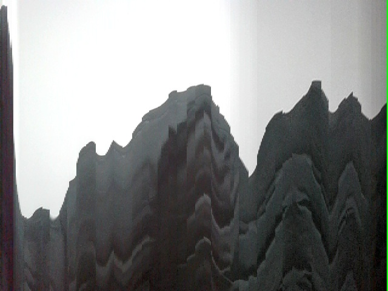](https://github.com/wangqiqi/scan-effect)
- [项目地址](https://github.com/wangqiqi/scan-effect) - 扫描线效果生成器

### Virtual Drag and Drop
[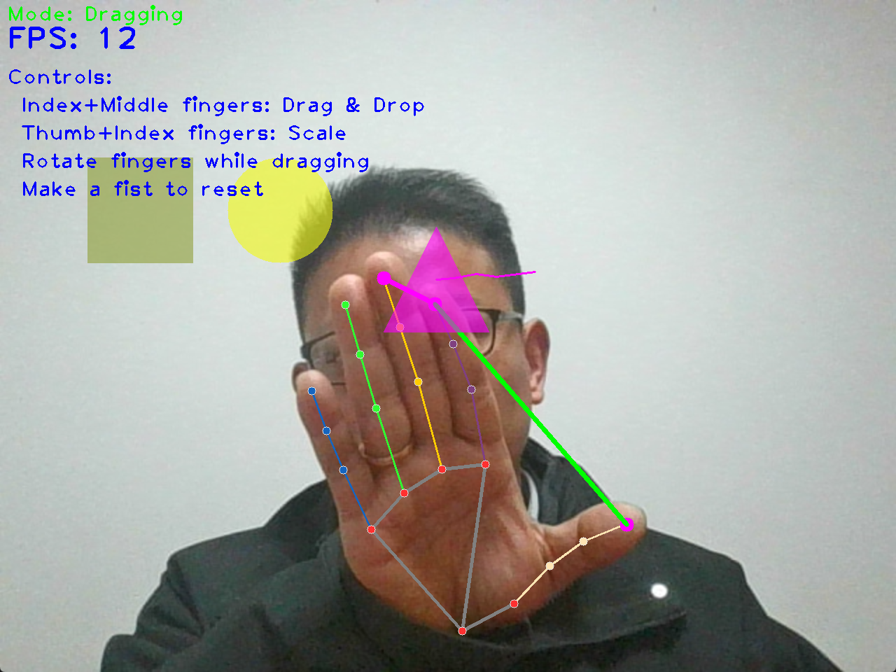](https://github.com/wangqiqi/virtual_drag_scale)
- [项目地址](https://github.com/wangqiqi/virtual_drag_scale) - 虚拟拖放与缩放应用

## 资源列表

- `images/gaze_laser_game1.png` - Eye Laser Game 演示图片
- `images/gensture_snake2.png` - Gesture Snake Game 演示图片
- `images/gensture_snake.png` - Gesture Snake Game 备用演示图片
- `images/ar_pi_1.png` - AR Pi Tattoo 主要演示图片
- `images/ar_pi_2.png` - AR Pi Tattoo 辅助演示图片
- `images/head_racing_game.png` - Head Racing Game 演示图片
- `images/face_mask.png` - Face Mask Application 演示图片
- `images/hand_vol.png` - Hand Gesture Volume Control 演示图片
- `images/scan_effect.jpg` - Scan Effect Generator 演示图片
- `images/virtual_drag.png` - Virtual Drag and Drop 演示图片
- `images/wechat.jpg` - 联系方式二维码

## 联系方式

<table>
  <tr align="center">
    <td>
       
      <b>微信</b>
    </td>
    <td>
       
      <b>哔哩哔哩</b>
    </td>
    <td>
       
      <b>抖音</b>
    </td>
    <td>
       
      <b>小红书</b>
    </td>
    <td>
       
      <b>CSDN</b>
    </td>
  </tr>
  <tr align="center">
    <td>
      
    </td>
    <td>
      
    </td>
    <td>
      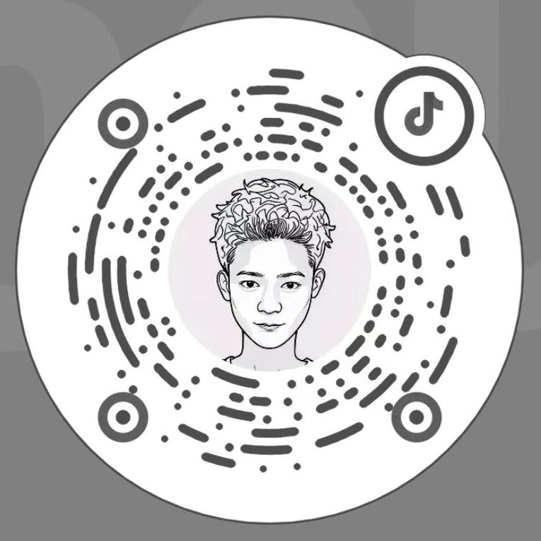
    </td>
    <td>
      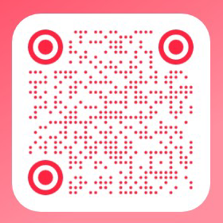
    </td>
    <td>
      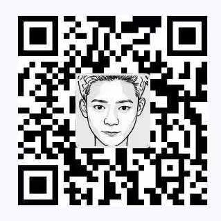
    </td>
  </tr>
</table>

  
  &nbsp;&nbsp;
  

